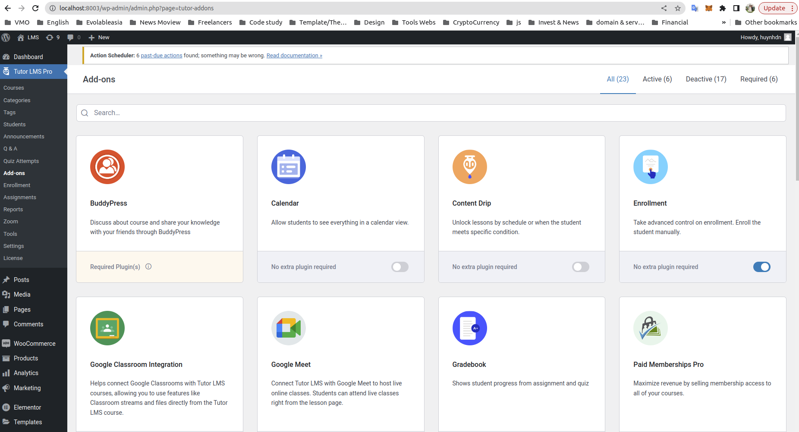

# LMS (Learning Management System)

Open Source Wordpress build by LMS (Learning Management System).

## Description

eLearning page is using [Tutor LMS pro](https://www.themeum.com/tutor-lms/pricing/) plugins

## Features

